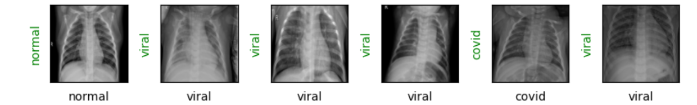

# 🩺 Detecting COVID-19 from Chest X-Ray Images using PyTorch

## 📌 Project Overview

This project implements a Deep Learning-based image classification system to detect **COVID-19 infection from Chest X-Ray images** using a Convolutional Neural Network (CNN) built with **PyTorch**.

The model classifies X-ray images into three categories:

- ✅ Normal  
- 🦠 Viral Pneumonia  
- 🧬 COVID-19  

This project demonstrates practical knowledge of:
- Custom Dataset creation in PyTorch
- Transfer Learning using pretrained models
- Model training & validation loops
- Performance evaluation
- End-to-end Deep Learning workflow

---

## 🧠 Model Architecture

- 🔹 Pretrained **ResNet18**
- 🔹 Modified final fully connected layer (3 output classes)
- 🔹 Loss Function: CrossEntropyLoss
- 🔹 Optimizer: Adam
- 🔹 GPU support (if available)

Transfer learning was used to leverage pretrained ImageNet weights for improved convergence and better accuracy.

---

## 📊 Dataset

**COVID-19 Radiography Database**

- Contains labeled Chest X-Ray images
- 3 Classes: Normal, Viral Pneumonia, COVID-19

Dataset Source:
https://www.kaggle.com/datasets/tawsifurrahman/covid19-radiography-database

> ⚠ Dataset not included in this repository due to large size.

---

## 🔄 Data Preprocessing & Augmentation

### Training Set:
- Resize
- Random Horizontal Flip
- Convert to Tensor
- Normalization

### Test Set:
- Resize
- Convert to Tensor
- Normalization

---

## 🚀 Training Pipeline

The training process includes:

1. Forward pass
2. Loss computation
3. Backward propagation
4. Parameter update
5. Periodic validation
6. Accuracy tracking

Best practices followed:
- model.train() and model.eval() modes
- torch.no_grad() during validation
- Proper GPU handling using device management
- Correct accuracy calculation

---

## 📈 Results

- Validation Accuracy: **(Add your accuracy here, e.g., 94%)**
- Training loss tracked per epoch
- Model evaluated on unseen test data

(Add prediction or training graph images here if available)

Example:

## Sample Predictions

---

## 🛠 Technologies Used

- Python
- PyTorch
- Torchvision
- NumPy
- Matplotlib
- PIL

---
## 💡 Key Learning Outcomes

- Built a custom PyTorch Dataset class
- Implemented full training and validation loops
- Applied transfer learning using ResNet18
- Managed GPU acceleration
- Evaluated model performance properly
- Deployed project to GitHub

---

## 🔮 Future Improvements

- Add model checkpoint saving (.pth file)
- Convert notebook to modular Python script
- Deploy as a web app using Streamlit
- Add Grad-CAM for model explainability

---
